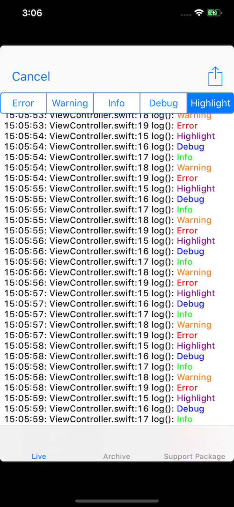
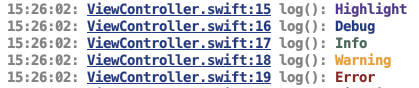
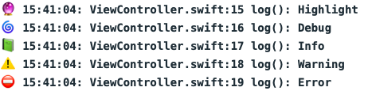

# QLog

[](https://swift.org/)
[]()

[](https://travis-ci.org/QuantumApplications/QLog) [](https://github.com/realm/SwiftLint/) []() [](https://codecov.io/gh/QuantumApplications/QLog) [](https://bettercodehub.com/) [](https://www.codacy.com/app/christian.michael.oberdoerfer/QLog?utm_source=github.com&amp;utm_medium=referral&amp;utm_content=QuantumApplications/QLog&amp;utm_campaign=Badge_Grade) [](https://codebeat.co/projects/github-com-quantumapplications-qlog-master)

Swift Logging Framework

Based on [QorumLogs](https://github.com/goktugyil/QorumLogs) by [goktugyil](https://github.com/goktugyil) and [BugshotKit](https://github.com/marcoarment/BugshotKit) by [Marco Arment](https://marco.org).

Add live logging, file logging and colored console logging to your app in few easy steps.



## Installation

1. Add the QLog framework (QLog.xcodeproj) to your project
2. Add QLog.framework to the embedded binaries of your target
3. In the AppDelegate add
    1. `import QLog`
    2. `QLog.loggers = [AppCodeLogger(), XcodeLogger(), FileLogger(), UiLogger.shared]` to `func application`

## Usage

In any file just import QLog and use the static logging functions to log any object or text together with time, function and line number.

There are five different log levels:
- QLogHighlight
- QLogDebug
- QLogInfo
- QLogWarning
- QLogError


```swift
QLogHighlight("Highlight")
QLogDebug("Debug")
QLogInfo("Info")
QLogWarning("Warning")
QLogError("Error")
```



For an example project see the QLogExample project in the repository.
    
## Configuration
To activate a logger just add it to the `QLog.loggers` array:

`QLog.loggers = [AppCodeLogger(), XcodeLogger(), FileLogger(), UiLogger.shared]`

Each logger can be configured separately.

### AppCode logger

The AppCode logger allows colored logging in [AppCode](https://www.jetbrains.com/objc/). It uses ANSI coloring, which means that the final colors depend on the settings in your IDE.


At creation you can choose the log level:

`AppCodeLogger(logLevel: .error)`

The default is **Highlight**.

### XCode logger

Since Xcode does not allow plugins any more, there is no possibility to achieve colored log output. As fallback the XcodeLogger starts all log messages with colored emojis for better recognition.



At creation you can choose the log level:

`XcodeLogger(logLevel: .error)`

The default is **Highlight**.

### File logger

You can also add a file logger to collect data for later analysis. If you enable the UiLogger, you an generate a "Support Package", which bundles all collected log files into a ZIP file and allows the user to share this file.

You can add as many file loggers as you want and choose the log level as well as the log location:

`FileLogger(logLevel: .error, logUrl: FileManager.default.urls(for: .documentDirectory, in: .userDomainMask)[0].appendingPathComponent("myLogs"))`

The default log level is **Info**, the default log location is **"log"** inside the documents directory.

Each application target (host app, share extension etc.) creates a subdirectory in the loc directory, so you can access for example the log files of your share extension from inside your host app. To make this work you need to set an app group URL as log location. For each start of your app (or any of its targets) a new log file file be created. Your file tree will then look like this:

- log
    - HostApp
        - 2019-02-27 15:00:00.log
        - 2019-02-27 15:05:00.log
    - Share Extension
        - 2019-02-27 16:03:00.log
        - 2019-02-27 16:07:00.log
        
### UiLogger

You can add the UI logger to perform live logging and access the log files of the FileLogger. If added, you can open the UI with a right-to-left swipe gesture starting at the top right corner of your devices. You will then see a live logging view for all logs performed.


With the buttons in the top row you can switch between the different log levels and with the share button you can share the current live log as HTML file. You can also switch to archive mode to access older log files from previous sessions. Third, you can create a support package of all log files collected so far and share them.

As for the FileLogger you can choose the starting log level as well as the log location:
                      
`UiLogger.shared.with(logLevel: .error, logUrl: FileManager.default.urls(for: .documentDirectory, in: .userDomainMask)[0].appendingPathComponent("myLogs"))`

Default log level and log location are the same as for the FileLogger. Since you can have only one UiLogger, you can choose only one log location to read the log files from.

## License

QLog is released under the MIT license. See the [LICENSE](https://github.com/QuantumApplications/QLog/blob/master/LICENSE) file for details.